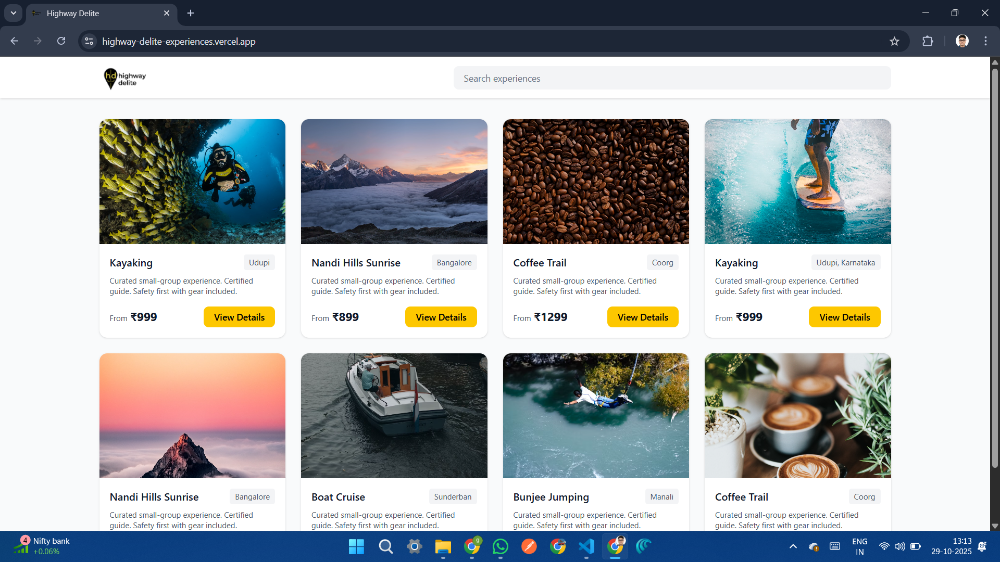
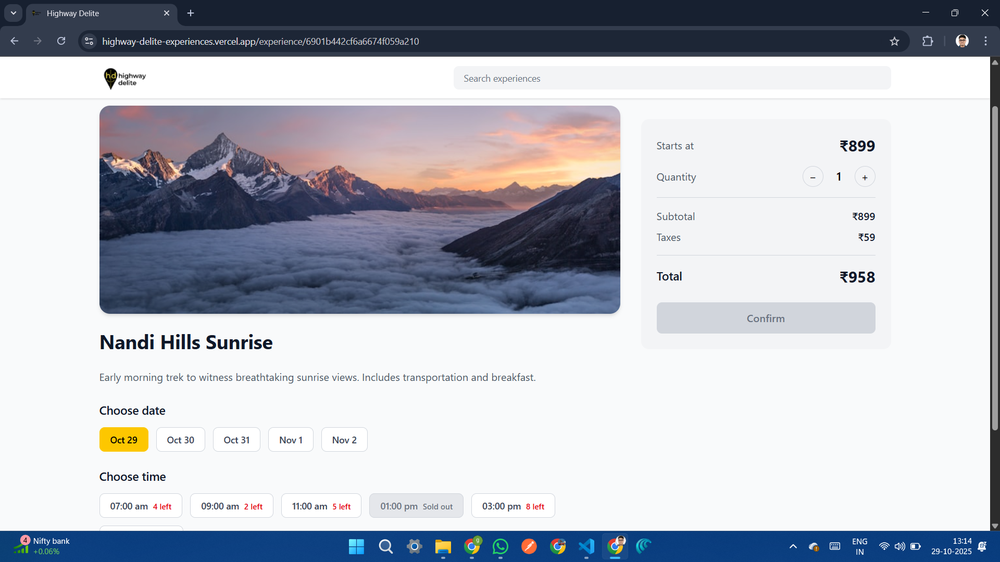
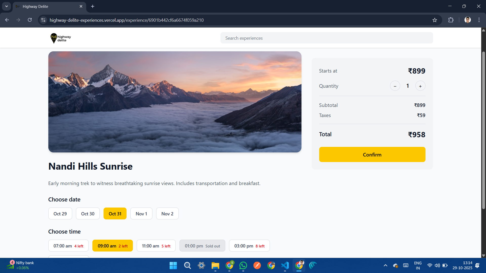
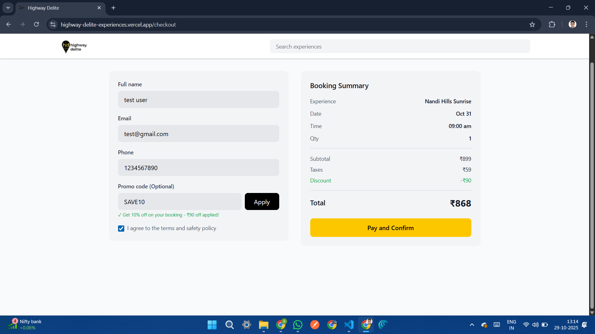
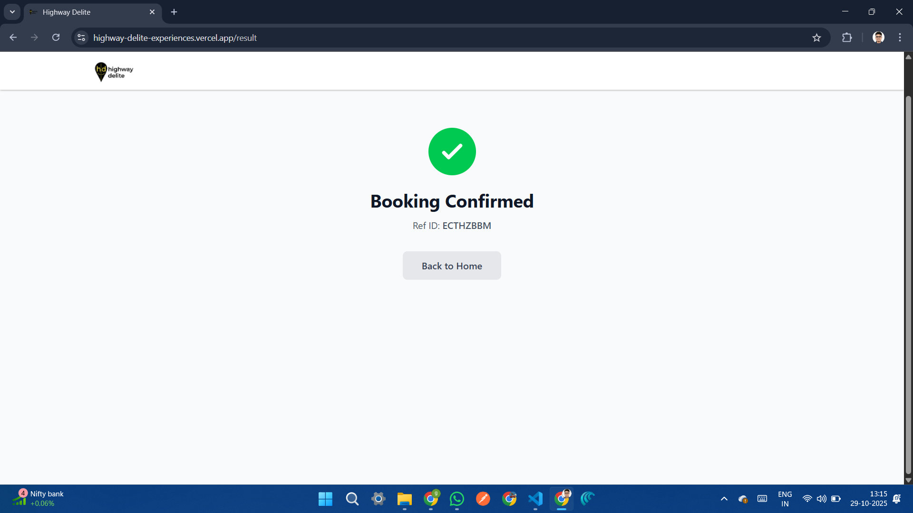

# 🎉 Highway Delite: Travel Experiences Booking Platform

A complete fullstack MERN application for booking travel experiences with real-time slot management, promo code validation, and seamless user experience.

## 🌟 Live Demo

- **Frontend**: https://highway-delite-experiences.vercel.app/
- **Backend API**: https://highway-delite-zixw.onrender.com

## 📸 Screenshots







## 🏗️ Tech Stack

### Frontend
- **Framework**: React 18 with Vite
- **Language**: JavaScript (ES6+)
- **Styling**: TailwindCSS 3
- **Routing**: React Router v6
- **HTTP Client**: Axios
- **Build Tool**: Vite

### Backend
- **Runtime**: Node.js
- **Framework**: Express.js
- **Database**: MongoDB with Mongoose
- **API**: RESTful architecture
- **Validation**: Built-in Express validators

## ✨ Features

### User Features
- ✅ Browse travel experiences with search
- ✅ View detailed experience information
- ✅ Select date and time slots with real-time availability
- ✅ Adjust booking quantity
- ✅ Apply promotional codes for discounts
- ✅ Complete booking with form validation
- ✅ Receive booking confirmation with reference ID

### Technical Features
- ✅ Responsive design (mobile, tablet, desktop)
- ✅ Real-time slot availability management
- ✅ Double booking prevention
- ✅ Promo code validation system
- ✅ Automatic price calculations
- ✅ Form validation (client & server)
- ✅ Clean state management with React hooks
- ✅ RESTful API architecture
- ✅ Error handling and loading states

## 📁 Project Structure

```
bookit/
├── backend/
│   ├── models/
│   │   ├── Experience.js
│   │   ├── Booking.js
│   │   └── PromoCode.js
│   ├── routes/
│   │   ├── ExperienceRoutes.js
│   │   ├── BookingRoutes.js
│   │   └── PromoCode.js
│   ├── server.js
│   ├── seed.js
│   └── package.json
│
├── frontend/
│   ├── src/
│   │   ├── components/
│   │   │   └── Header.jsx
│   │   ├── pages/
│   │   │   ├── HomePage.jsx
│   │   │   ├── DetailsPage.jsx
│   │   │   ├── CheckoutPage.jsx
│   │   │   └── ResultPage.jsx
│   │   ├── App.jsx
│   │   ├── main.jsx
│   │   └── index.css
│   ├── index.html
│   ├── vite.config.js
│   └── package.json
│
└── README.md
```

## 🚀 Quick Start

### Prerequisites
- Node.js v14+ 
- MongoDB (local or Atlas)
- npm or yarn

### Backend Setup

1. **Navigate to backend directory**
```bash
cd backend
```

2. **Install dependencies**
```bash
npm install
```

3. **Create .env file**
```env
MONGODB_URI=mongodb://localhost:27017/bookit
PORT=5000
```

4. **Seed the database**
```bash
npm run seed
```

5. **Start the server**
```bash
npm run dev
```

Backend runs on `http://localhost:5000`

### Frontend Setup

1. **Navigate to frontend directory**
```bash
cd frontend
```

2. **Install dependencies**
```bash
npm install
```

3. **Create .env file**
```env
VITE_API_URL=http://localhost:5000/api
```

4. **Start development server**
```bash
npm run dev
```

Frontend runs on `http://localhost:3000`

## 📡 API Endpoints

### Experiences
```
GET    /api/experiences              # Get all experiences (with search)
GET    /api/experiences/:id          # Get single experience with slots
POST   /api/experiences              # Create new experience (admin)
```

### Bookings
```
GET    /api/bookings                 # Get all bookings (admin)
GET    /api/bookings/:bookingRef     # Get booking by reference
POST   /api/bookings                 # Create new booking
```

### Promo Codes
```
GET    /api/promo                    # Get all promo codes (admin)
POST   /api/promo/validate           # Validate promo code
POST   /api/promo                    # Create promo code (admin)
```

## 🎨 Design Specifications

### Color Palette
- **Primary Yellow**: `#FDD835` - Buttons, highlights
- **Black**: `#000000` - Text, navigation
- **Gray Scale**: 
  - `#F9FAFB` - Background (gray-50)
  - `#F3F4F6` - Cards (gray-100)
  - `#E5E7EB` - Borders (gray-200)
  - `#6B7280` - Secondary text (gray-600)

### Typography
- **Font Family**: System fonts
- **Sizes**: 
  - Headings: 24px - 36px
  - Body: 14px - 16px
  - Small: 12px

### Responsive Breakpoints
- **Mobile**: < 640px (1 column)
- **Tablet**: 640px - 1024px (2 columns)
- **Desktop**: > 1024px (4 columns)

## 🎯 Pre-seeded Data

### Sample Experiences (8 total)
1. Kayaking - Udupi - ₹999
2. Nandi Hills Sunrise - Bangalore - ₹899
3. Coffee Trail - Coorg - ₹1299
4. Boat Cruise - Sunderban - ₹999
5. Bunjee Jumping - Manali - ₹999
6. And more...

### Promo Codes
| Code | Type | Value | Min Order |
|------|------|-------|-----------|
| `SAVE10` | Percentage | 10% | ₹500 |
| `FLAT100` | Flat | ₹100 | ₹800 |
| `FIRSTBOOK` | Percentage | 15% | ₹1000 |
| `WEEKEND50` | Flat | ₹50 | ₹500 |

## 🚢 Deployment Guide

### Backend Deployment (Render/Railway)

**Render:**
1. Create new Web Service
2. Connect GitHub repository
3. Set build command: `npm install`
4. Set start command: `npm start`
5. Add environment variable: `MONGODB_URI`
6. Deploy

### Frontend Deployment (Vercel/Netlify)

**Vercel:**
```bash
npm i -g vercel
cd frontend
vercel
```


### MongoDB Atlas Setup

1. Create cluster at [mongodb.com/cloud/atlas](https://www.mongodb.com/cloud/atlas)
2. Create database user
3. Whitelist IP (0.0.0.0/0 for development)
4. Get connection string
5. Update `.env` with connection string

## 🧪 Testing

### Test the Complete Flow

1. **Home Page**
   - Browse experiences
   - Search for "Kayaking"
   - Click "View Details"

2. **Details Page**
   - Select date: Oct 22
   - Select time: 9:00 am
   - Adjust quantity: 2
   - Click "Confirm"

3. **Checkout Page**
   - Enter name, email, phone
   - Apply promo: `SAVE10`
   - Check terms
   - Click "Pay and Confirm"

4. **Result Page**
   - See confirmation
   - Note booking reference
   - Click "Back to Home"

## 🔒 Security Features

- Input validation (client & server)
- Email format validation
- MongoDB injection prevention
- CORS configuration
- Error handling without exposing internals

## 📊 Database Schema

### Experience Model
```javascript
{
  title: String,
  location: String,
  price: Number,
  description: String,
  image: String,
  slots: [{
    date: String,
    times: [{
      time: String,
      availableSlots: Number,
      status: String
    }]
  }]
}
```

### Booking Model
```javascript
{
  experienceId: ObjectId,
  userName: String,
  userEmail: String,
  date: String,
  time: String,
  quantity: Number,
  total: Number,
  bookingRef: String
}
```

## 🛠️ Development

### Run Both Servers Concurrently

Create a `package.json` in root:
```json
{
  "scripts": {
    "dev:backend": "cd backend && npm run dev",
    "dev:frontend": "cd frontend && npm run dev",
    "dev": "npm run dev:backend & npm run dev:frontend"
  }
}
```

Then run:
```bash
npm run dev
```


## 🐛 Known Issues

None currently. Report issues on GitHub.

## 🤝 Contributing

1. Fork the repository
2. Create feature branch (`git checkout -b feature/AmazingFeature`)
3. Commit changes (`git commit -m 'Add AmazingFeature'`)
4. Push to branch (`git push origin feature/AmazingFeature`)
5. Open Pull Request

## 📝 License

MIT License - feel free to use this project for learning or commercial purposes.

## 👨‍💻 Author

Gautam Aggarwal
- GitHub: @gautamaggarwaldev
- LinkedIn: https://www.linkedin.com/in/gautam-aggarwal-/

## 🙏 Acknowledgments

- Images from Unsplash (royalty-free)
- Design inspiration from modern booking platforms
- Built as a fullstack intern assignment

## 📞 Support

For questions or issues:
- Open an issue on GitHub
- Email: gautam.aggarwal.tech@gmail.com

---


**⭐ If you like this project, please give it a star!**
